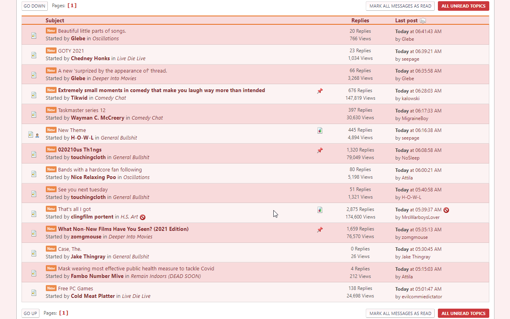
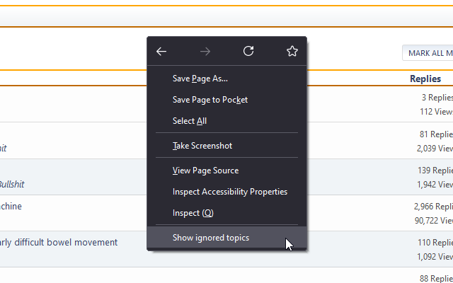
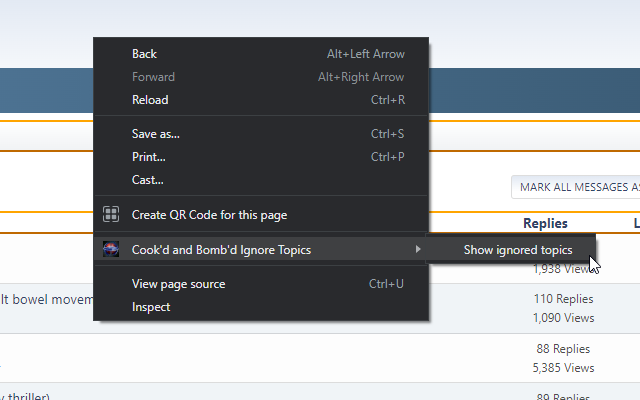
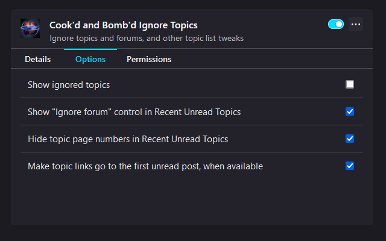
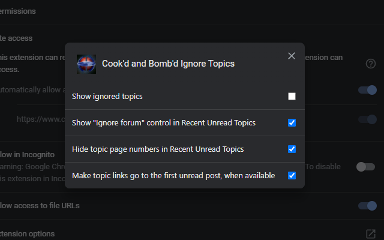

# Cook'd and Bomb'd Ignore Topics

Ignore topics and forums, and other topic list tweaks for cookdandbombd.co.uk

* [Install Firefox Add-on](https://addons.mozilla.org/en-US/firefox/addon/cookd-and-bombd-ignore-topics/)
* [Install Chrome Extension](https://chrome.google.com/webstore/detail/bigpbodobkhbhhmjchjndlfgpigchpjh/)
* [Install as a user script](https://greasyfork.org/en/scripts/406588-cook-d-and-bomb-d-ignore-topics) (requires a [user script manager](https://greasyfork.org/en#home-step-1))

## Ignoring

Hover over a topic and an ignore icon will appear at the end of the topic's row; clicking it will hide the topic, and it will be hidden on subsequent visits to the forum it's in, and on the Recent Unread Topics page.

On the Recent Unread Topics page, an ignore icon will also appear next to the forum a topic is in; clicking it will hide all topics in that forum when browsing Recent Unread Topics.

## Unignoring

If you've accidentally ignored the wrong thing, or if you realise you want to read about _insert subject here_ more than you previously thought, open your browser's right-click/context menu and click "Show ignored topics" (this will be a top-level item in Firefox and under a "Cook'd and Bomb'd Ignore Topics" menu item in Chrome).

| Firefox | Chrome |
|:-------:|:------:|
|  |  |

Ignored topics will be displayed with a fetching salmon highlight and clicking the appropriate ignore icon on them (you may have ignored a topic individually, by forum or both) will unignore them. You can then re-hide ignored topics using the same menu item.

## Other Tweaks

By default, this extension also hides topic page number links in the Recent Unread Topics view and makes topic links go to the first unread post (when available).

These can be configured in its options:

| Firefox | Chrome |
|:-------:|:------:|
|  |  |
